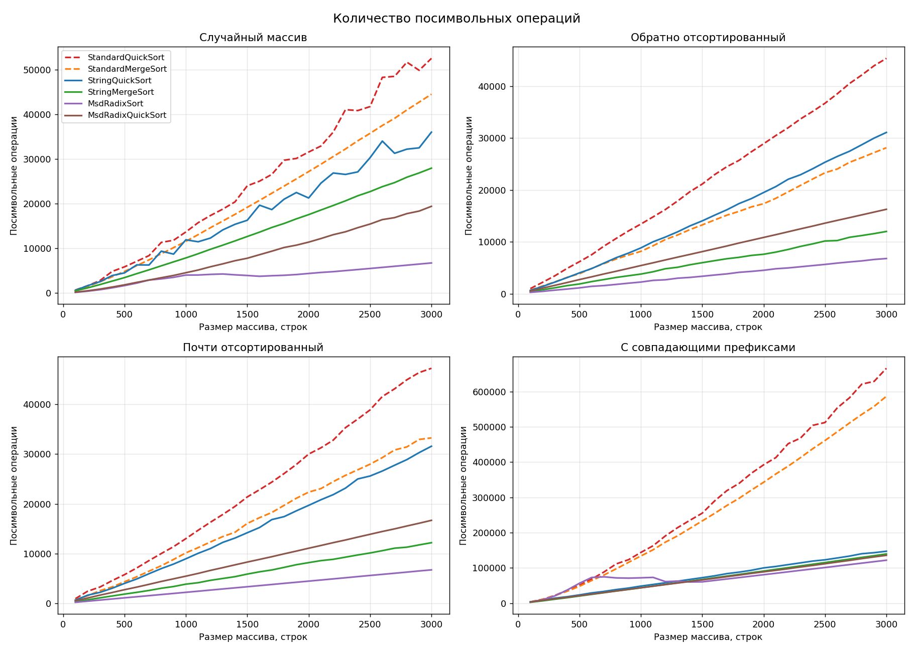
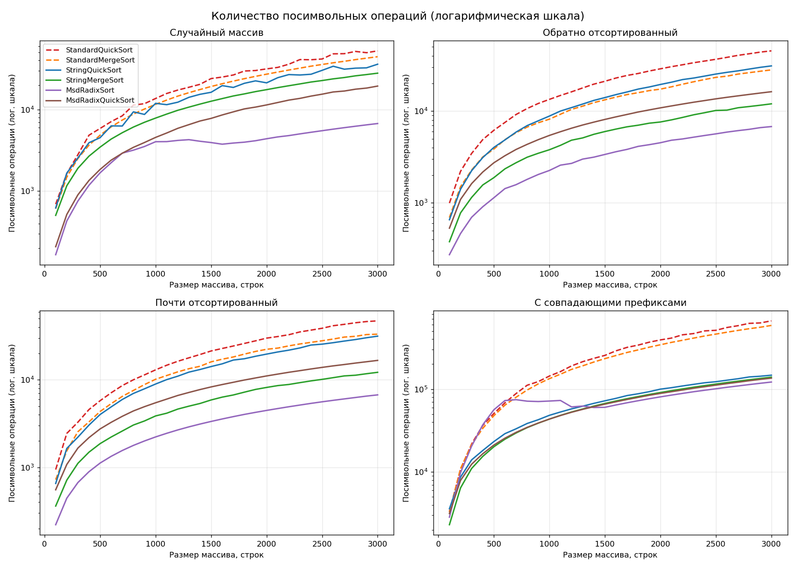
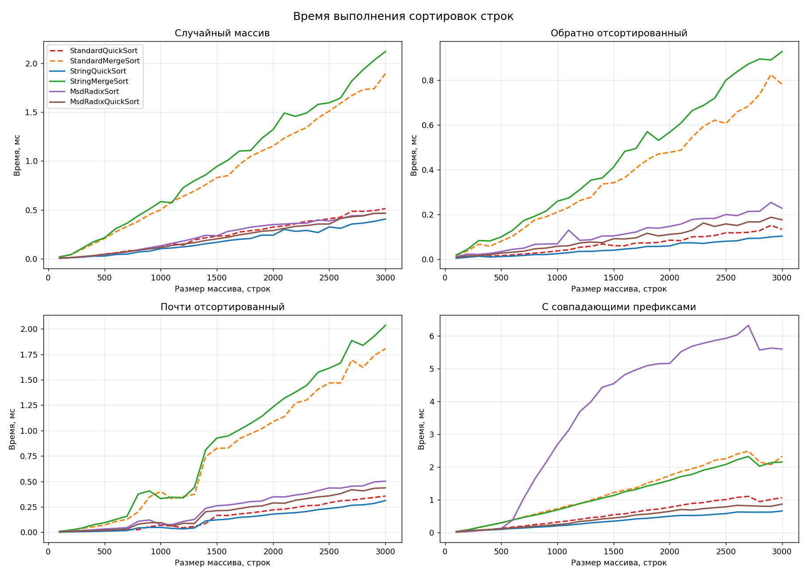

# A1. Анализ строковых сортировок

Эмпирическое исследование обычных и адаптированных алгоритмов сортировки
массивов строк. Сравниваются время выполнения и количество посимвольных
операций; результаты сопоставляются с теоретическими оценками сложности.

## Содержание репозитория

| Файл | Назначение |
|------|-----------|
| `string_generator.h` | Класс `StringGenerator` — генерация тестовых массивов строк |
| `sorts.h` | Реализации шести алгоритмов сортировки с подсчётом посимвольных операций |
| `string_sort_tester.h` | Класс `StringSortTester` — измерение времени, операций, проверка корректности |
| `experiment.cpp` | Точка входа: полный прогон исследования, вывод `results.csv` |
| `plot.py` | Построение графиков по `results.csv` |
| `A1m.cpp`, `A1q.cpp`, `A1r.cpp`, `A1rq.cpp` | Решения подзадач CodeForces |
| `Makefile` | Сборка и запуск |
| `results.csv` | Полученные эмпирические данные |
| `plots/` | Графики по результатам замеров |

## Сборка и запуск

```bash
make run     # сборка + полный прогон, формирует results.csv
make plots   # построение графиков в plots/
make cf      # сборка решений подзадач CodeForces
```

Для графиков используется `uv` (matplotlib подтягивается автоматически).

---

## Этап 1. Подготовка тестовых данных

Класс `StringGenerator` формирует массивы случайных строк над алфавитом из
заглавных и строчных латинских букв, цифр и специальных символов
`!@#%:;^&*()-.`. Длина строк — от 10 до 200 символов.

Реализовано четыре типа массивов:

- **`random`** — полностью неупорядоченный набор;
- **`reverse`** — отсортированный в обратном лексикографическом порядке;
- **`almost`** — отсортированный массив с небольшим числом перестановок пар
  строк (≈1 % от размера), равномерно распределённых по массиву;
- **`prefixed`** — строки сгруппированы вокруг небольшого числа общих
  префиксов; нагрузочный случай для алгоритмов, основанных на посимвольном
  сравнении.

Для каждого типа однократно генерируется массив максимальной длины (3000
строк), из которого для замеров берутся подмассивы нужного размера
(100, 200, …, 3000). Перестановки в `almost`-массиве распределены равномерно,
поэтому свойство «почти отсортирован» сохраняется и для подмассивов.

---

## Этап 2. Стандартные алгоритмы сортировки

Обычные алгоритмы, работающие на основе сравнения строк целиком:

- **`StandardQuickSort`** — быстрая сортировка с разбиением Ломуто; опорный
  элемент — средний элемент фрагмента;
- **`StandardMergeSort`** — нисходящая сортировка слиянием.

Сравнение двух строк (`cmpStrings`) посимвольно сопоставляет символы до
первого различия; каждое такое сопоставление учитывается счётчиком.

## Этап 3. Адаптированные алгоритмы сортировки

- **`StringQuickSort`** — тернарный (трёхпутевой) строковый quicksort.
  Разбиение ведётся по одному символу позиции `d`; равные символу опорного
  элементы остаются в средней части и обрабатываются на позиции `d+1`.
  Опорный элемент — средний (как и в стандартной версии).
- **`StringMergeSort`** — сортировка слиянием с использованием длины
  наибольшего общего префикса. Каждый отсортированный отрезок хранится вместе
  с массивом `lcp` (общие префиксы соседних элементов); при слиянии сравнение
  очередной пары строк начинается с позиции уже известного общего префикса, и
  совпавшая часть повторно не сравнивается.
- **`MsdRadixSort`** — поразрядная сортировка со старшего разряда без
  переключения на quicksort; на малых фрагментах (< 16) используется
  сортировка вставками.
- **`MsdRadixQuickSort`** — MSD radix sort с переключением на тернарный
  строковый quicksort, когда длина фрагмента становится меньше мощности
  алфавита (74).

Для поразрядных алгоритмов посимвольной операцией считается обращение к
символу (извлечение разряда). Это согласуется с теоретической оценкой radix
sort и позволяет сопоставлять все алгоритмы по объёму работы на уровне
отдельных символов.

---

## Методика измерений

Класс `StringSortTester` для каждой пары (тип массива, размер) прогоняет все
шесть алгоритмов:

1. **Корректность** — результат сверяется с эталоном (`std::sort`); при
   расхождении бросается исключение.
2. **Посимвольные операции** — один прогон с обнулённым счётчиком `g_charCmp`.
3. **Время** — многократные прогоны на свежей копии массива до накопления
   измеримого интервала (≥ 50 мс, не менее 5 прогонов), итог усредняется по
   числу прогонов. Копирование массива в измеряемый интервал не входит.

Замеры охватывают 4 типа массивов × 30 размеров × 6 алгоритмов = 720
конфигураций; результаты выгружаются в `results.csv`.

---

## Результаты

### Графики

Количество посимвольных операций (линейная и логарифмическая шкала):





Время выполнения:



### Сводка по массиву из 3000 строк

| Тип | Алгоритм | Время, мс | Посимвольные операции |
|-----|----------|----------:|----------------------:|
| random | StandardQuickSort | 0.51 | 52 487 |
| random | StandardMergeSort | 1.90 | 44 477 |
| random | StringQuickSort | 0.41 | 35 989 |
| random | StringMergeSort | 2.12 | 27 934 |
| random | MsdRadixSort | 0.46 | 6 739 |
| random | MsdRadixQuickSort | 0.47 | 19 405 |
| prefixed | StandardQuickSort | 1.06 | 666 194 |
| prefixed | StandardMergeSort | 2.32 | 586 881 |
| prefixed | StringQuickSort | 0.65 | 147 253 |
| prefixed | StringMergeSort | 2.15 | 139 509 |
| prefixed | MsdRadixSort | 5.59 | 121 740 |
| prefixed | MsdRadixQuickSort | 0.86 | 135 578 |

---

## Анализ и сопоставление с теорией

### Стандартные алгоритмы

Оба стандартных алгоритма выполняют `O(n·log n)` сравнений строк. Графики
посимвольных операций на случайном, обратном и почти отсортированном массивах
имеют характерную форму `n·log n`. Так, для случайного массива стандартный
quicksort на 3000 строк делает ≈ 52 000 операций, что близко к
`1.5·n·log₂n ≈ 1.5·3000·11.5`.

На случайных данных каждое сравнение строк завершается, как правило, на первом
же символе (вероятность совпадения первых символов ≈ 1/74), поэтому число
посимвольных операций близко к числу сравнений строк. Принципиальная слабость
этих алгоритмов проявляется на массиве `prefixed`: при длинных общих префиксах
каждое сравнение вынуждено посимвольно проходить весь совпадающий префикс, и
объём работы возрастает на порядок (666 тыс. против 52 тыс. операций для
quicksort). Совпадающие префиксы сравниваются повторно при каждом сравнении —
именно эту избыточность устраняют адаптированные алгоритмы.

### Тернарный строковый quicksort

`StringQuickSort` устойчиво превосходит стандартный quicksort и по времени, и
по числу операций (на случайном массиве — ≈ 0.69 от операций стандартной
версии). Каждый символ участвует в разбиении ровно один раз на своём уровне
рекурсии, общий совпадающий префикс не пересравнивается. Теоретическая оценка —
`O(n·log n + N)`, где `N` — суммарная длина различающих префиксов; на массиве
`prefixed` выигрыш относительно стандартного quicksort достигает 4.5 раза.

### Строковый merge sort с LCP

`StringMergeSort` по числу посимвольных операций — лучший среди алгоритмов на
основе сравнений: на случайном массиве ≈ 0.63 от стандартного merge sort, на
`prefixed` — в 4.2 раза меньше. За счёт передачи `lcp`-массивов между уровнями
слияния совпавшая часть строк не сравнивается повторно, число операций
приближается к `O(n·log n)` без множителя длины строки.

При этом по **времени** `StringMergeSort` не быстрее стандартного merge sort:
обе версии тратят основное время на `O(n·log n)` перемещений строк между
буферами, а не на сравнения символов. Это наглядно показывает, что выигрыш в
числе сравнений не всегда переходит в выигрыш по времени, если доминирует
другая составляющая стоимости.

### MSD radix sort

`MsdRadixSort` даёт минимальное число посимвольных операций среди всех
алгоритмов на равномерных данных (≈ 6700 на 3000 строк — на порядок меньше
стандартных): каждый символ читается ровно один раз, сортировка не основана
на сравнениях. Это соответствует теоретической оценке `O(n·d)`, где `d` —
средняя глубина различающего префикса.

Однако по времени на массиве `prefixed` чистый MSD radix sort оказывается
**самым медленным** (5.6 мс). При длинных общих префиксах рекурсия уходит на
большую глубину, и на каждом уровне выделяется и обнуляется массив счётчиков
на 256 значений, большинство из которых пустые. Накладные расходы на работу с
разрядной таблицей перевешивают экономию на сравнениях.

### MSD radix sort с переключением на quicksort

`MsdRadixQuickSort` устраняет указанный недостаток: как только фрагмент
становится меньше мощности алфавита, обработка передаётся тернарному
строковому quicksort, что исключает создание разрядных таблиц для мелких
фрагментов. На массиве `prefixed` это даёт ускорение с 5.6 мс до 0.86 мс при
сопоставимом числе посимвольных операций. Гибрид сочетает малое число операций
поразрядной сортировки с низкими накладными расходами quicksort на мелких
фрагментах и оказывается наиболее сбалансированным алгоритмом по совокупности
«время + операции».

### Итог

- По числу посимвольных операций адаптированные алгоритмы превосходят
  стандартные на всех типах данных; разрыв максимален на массивах с
  совпадающими префиксами.
- Наименьшее число операций — у `MsdRadixSort`; лучший среди основанных на
  сравнениях — `StringMergeSort` с LCP.
- По времени лучший баланс показывает `MsdRadixQuickSort`; чистый MSD radix
  sort проигрывает из-за накладных расходов разрядной таблицы на глубокой
  рекурсии.
- Эмпирические кривые числа операций согласуются с теоретическими оценками:
  `O(n·log n)` для алгоритмов на сравнениях и `O(n·d)` для поразрядных.
- Выигрыш в числе сравнений не тождественен выигрышу по времени: у merge
  sort время определяется перемещениями строк, а не сравнениями символов.

---

## Решения подзадач CodeForces

| Подзадача | Алгоритм | Файл | ID посылки |
|-----------|----------|------|-----------|
| A1m | STRING MERGE SORT | `A1m.cpp` | 374683571 |
| A1q | STRING QUICK SORT (тернарный) | `A1q.cpp` | 374683607 |
| A1r | MSD RADIX SORT без переключения | `A1r.cpp` | 374683682 |
| A1rq | MSD RADIX SORT с переключением на quicksort | `A1rq.cpp` | 374684891 |
